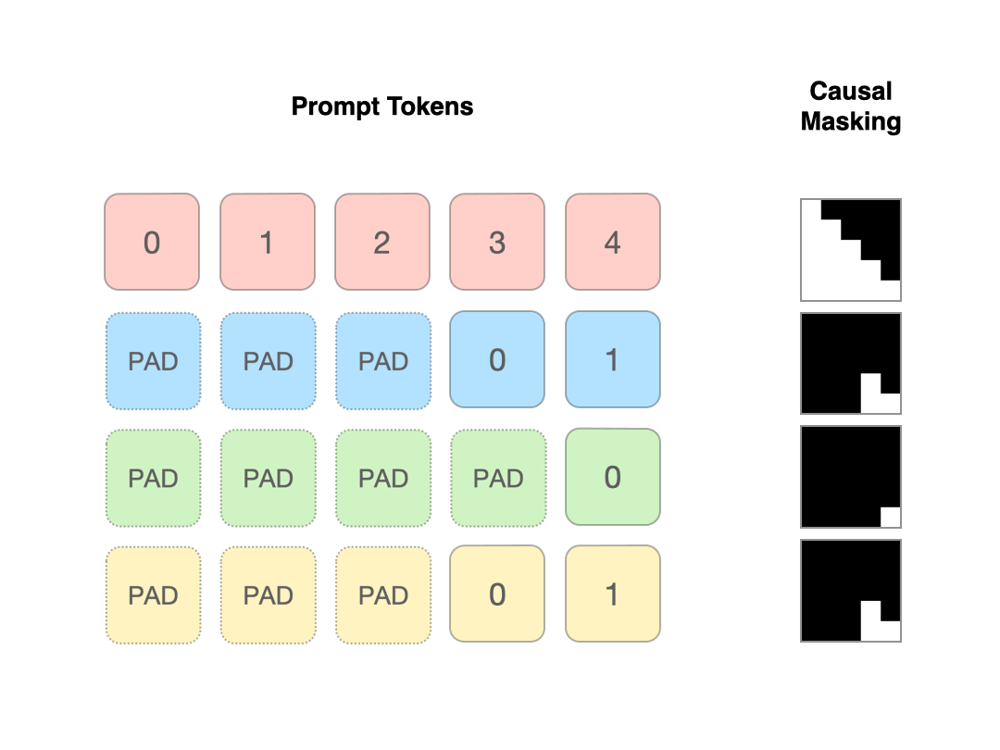

# Prepacking: A Simple Method for Fast Prefilling and Increased Throughput in Large Language Models

 The source code of our work **"Prepacking: A Simple Method for Fast Prefilling and Increased Throughput in Large Language Models"**
 
 [[paper]](https://arxiv.org/abs/2404.09529)
 


## Installation
```conda env create -f environment.yml```


## Profile speed and memory


### Profile Prefill or Time to First Token (TTFT) Time, and compare peak GPU Memory and Utilization

```CUDA_VISIBLE_DEVICES=0 python profiling_time_and_memory.py --metric=prefill --dataset=mmlu --batch_size=64 --model_name=llama1b --num_runs=5```

Example output when profiled on a single 48GB NVIDIA A6000 GPU:

| Method         | Avg prefill Time /batch (s) | Max GPU Utilization (%) | Max GPU Memory (MB) | Mean GPU Utilization (%) | Std Dev Time (s) | Std Dev Max GPU Util (%) | Std Dev Mean GPU Util (%) |
|----------------|-----------------------------|-------------------------|---------------------|--------------------------|------------------|--------------------------|---------------------------|
| prepacking     | 0.441                       | 100.000                 | 4578.328            | 91.156                   | 0.347            | 0.000                    | 7.966                     |
| full-batching  | 2.299                       | 100.000                 | 34599.695           | 99.719                   | 1.741            | 0.000                    | 0.223                     |
| length-ordered | 0.658                       | 100.000                 | 22950.019           | 97.865                   | 0.815            | 0.000                    | 3.236                     |

### Compare Per Prompt Inference Prefill Time Including Dataset Prepacking

```CUDA_VISIBLE_DEVICES=0 python profiling_dataset_level_prepacking.py  --metric=prefill --model_name=llama1b --batch_size=32 --loadbit=8 --dataset=mmlu```

### sanity check generation tokens.

```CUDA_VISIBLE_DEVICES=0 python generation_example_sanitycheck.py```

## Reference
If you find our work useful, please consider citing our [paper](https://arxiv.org/abs/2404.09529):

```
@misc{zhao2024prepacking,
      title={Prepacking: A Simple Method for Fast Prefilling and Increased Throughput in Large Language Models}, 
      author={Siyan Zhao and Daniel Israel and Guy Van den Broeck and Aditya Grover},
      year={2024},
      eprint={2404.09529},
      archivePrefix={arXiv},
      primaryClass={cs.LG}
}
```
