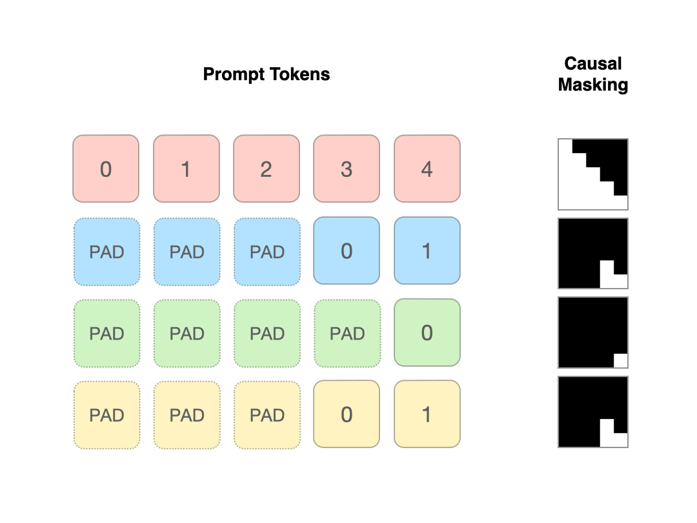

# Prepacking: A Simple Method for Fast Prefilling and Increased Throughput in Large Language Models
 
<p align="center">
  
</p>


This repository contains the source code of the following paper:

> **"Prepacking: A Simple Method for Fast Prefilling and Increased Throughput in Large Language Models"**<br>
> Siyan Zhao, Daniel Israel, Guy Van den Broeck, Aditya Grover<br>
>
> **Abstract:** *During inference for transformer-based large language models (LLM), prefilling is the computation of the key-value (KV) cache for input tokens in the prompt prior to autoregressive generation. For longer input prompt lengths, prefilling will incur a significant overhead on decoding time. In this work, we highlight the following pitfall of prefilling: for batches containing high-varying prompt lengths, significant computation is wasted by the standard practice of padding sequences to the maximum length. As LLMs increasingly support longer context lengths, potentially up to 10 million tokens, variations in prompt lengths within a batch become more pronounced. To address this, we propose Prepacking, a simple yet effective method to optimize prefilling computation. To avoid redundant computation on pad tokens, prepacking combines prompts of varying lengths into a sequence and packs multiple sequences into a compact batch using a bin-packing algorithm. It then modifies the attention mask and positional encoding to compute multiple prefilled KV-caches for multiple prompts within a single sequence. On standard curated dataset containing prompts with varying lengths, we obtain a significant speed and memory efficiency improvements as compared to the default padding-based prefilling computation within Huggingface across a range of base model configurations and inference serving scenarios.*

 
 [[Paper]](https://arxiv.org/abs/2404.09529)

## Setup Environment
### Clone the repository
```bash
git clone https://github.com/siyan-zhao/prepacking.git
cd prepacking
```

### Conda Setup
```
conda env create -f environment.yml
conda activate prepack
```

## Profile speed and memory


### Profile Prefill or Time to First Token (TTFT) Time, and compare peak GPU Memory and Utilization

```CUDA_VISIBLE_DEVICES=0 python profiling_time_and_memory.py --metric=prefill --dataset=mmlu --batch_size=64 --model_name=llama1b --num_runs=5```

Example output when profiled on a single 48GB NVIDIA A6000 GPU:

| Method         | Avg prefill Time /batch (s) | Max GPU Utilization (%) | Max GPU Memory (MB) | Mean GPU Utilization (%) | Std Dev Time (s) | Std Dev Max GPU Util (%) | Std Dev Mean GPU Util (%) |
|----------------|-----------------------------|-------------------------|---------------------|--------------------------|------------------|--------------------------|---------------------------|
| prepacking     | 0.441                       | 100.000                 | 4578.328            | 91.156                   | 0.347            | 0.000                    | 7.966                     |
| full-batching  | 2.299                       | 100.000                 | 34599.695           | 99.719                   | 1.741            | 0.000                    | 0.223                     |
| length-ordered | 0.658                       | 100.000                 | 22950.019           | 97.865                   | 0.815            | 0.000                    | 3.236                     |

### Compare Per Prompt Inference Prefill Time Including Dataset Prepacking

```CUDA_VISIBLE_DEVICES=0 python profiling_dataset_level_prepacking.py  --metric=prefill --model_name=llama1b --batch_size=32 --loadbit=8 --dataset=mmlu```

## Play with prepacking generation

[](https://colab.research.google.com/github/siyan-zhao/prepacking/blob/main/prepack_generation_demo.ipynb) to try prepacking generation and sanity check against default generation.

## Reference
If you find our work useful, please consider citing our [paper](https://arxiv.org/abs/2404.09529):

```
@misc{zhao2024prepacking,
      title={Prepacking: A Simple Method for Fast Prefilling and Increased Throughput in Large Language Models}, 
      author={Siyan Zhao and Daniel Israel and Guy Van den Broeck and Aditya Grover},
      year={2024},
      eprint={2404.09529},
      archivePrefix={arXiv},
      primaryClass={cs.LG}
}
```
